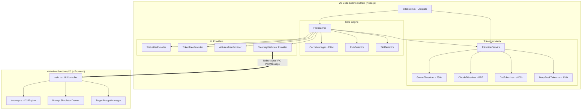
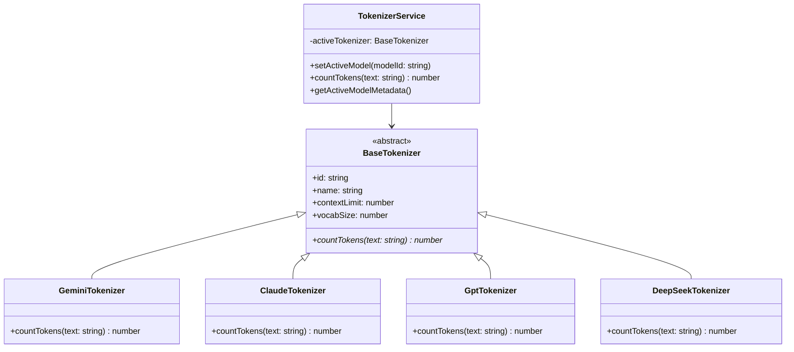
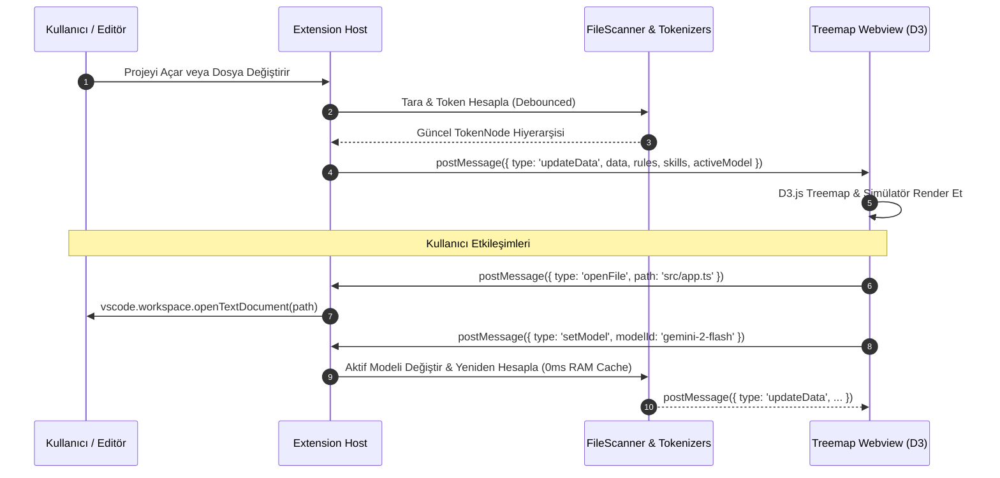

# 🏗️ Token Meter - Sistem Mimarisi & Teknik Tasarım (Architecture)

Bu belge, **Token Meter** VS Code eklentisinin yazılım mimarisini, veri akışını, bileşenler arası iletişim protokollerini ve performans tasarım prensiplerini detaylı olarak açıklamaktadır.

---

## 🧭 1. Üst Düzey Mimari Genel Bakış (High-Level Architecture)

Token Meter, **Katmanlı Mimari (Layered Architecture)** ve **Olay Güdümlü (Event-Driven)** tasarım desenleri üzerine kurulmuştur. VS Code Extension Host ortamı ile D3.js tabanlı Webview arayüzü birbirinden izole çalışır ve güvenli bir IPC (Inter-Process Communication) mesajlaşma köprüsüyle haberleşir.



---

## 🧱 2. Katmanlar ve Bileşen Detayları

### 🔹 Katman 1: Çekirdek Motor (Core Engine - `src/core/`)

Çekirdek motor, projedeki dosyaların taranması, AI kurallarının ve becerilerinin tespit edilmesi ve önbelleklemeden sorumludur:

#### 1. `FileScanner.ts` (Dosya Tarayıcı & Ağaç Oluşturucu)
* **Görev:** Projedeki tüm dosyaları tarar, `.gitignore` ve `tokenMeter.excludePatterns` kurallarına göre filtreler.
* **Hiyerarşik Ağaç:** Düz dosya listesini ebeveyn-çocuk ilişkili `TokenNode` hiyerarşisine dönüştürür.
* **Olay Tetikleme:** Dosya oluşturma, silme veya değiştirme olaylarını (`vscode.workspace.onDidChangeTextDocument`) dinler ve debounced olarak günceller.

#### 2. `CacheManager.ts` (Bellek İçi RAM Önbellek)
* **Görev:** Dosyaların token hesaplamalarını RAM üzerinde tutar (`Map<string, CacheEntry>`).
* **`mtime` Doğrulaması:** Dosyanın diskteki son değiştirilme zamanı (`mtimeMs`) değişmediği sürece tokenizer'ı tekrar çalıştırmaz.
* **Performans:** Model geçişlerinde veya yenilemelerde disk I/O yapmadan **0 milisaniyede** sonuç döner.

#### 3. `RuleDetector.ts` (AI Kuralları Dedektörü)
* **Görev:** Çalışma alanındaki yapay zeka kural dosyalarını otomatik tanır:
  * Cursor: `.cursorrules`, `.cursor/rules/*.mdc`
  * Antigravity / Gemini: `GEMINI.md`, `.gemini/rules/*`
  * Windsurf: `.windsurfrules`
  * Cline / Roo Code: `.clinerules`, `.roomodes`
  * GitHub Copilot: `.github/copilot-instructions.md`
* **Baseline Overhead:** Her prompt turunda harcanan zorunlu sabit taban token maliyetini hesaplar.

#### 4. `SkillDetector.ts` (Ekosisteme Duyarlı Beceri Dedektörü)
* **Görev:** Aktif modele göre bilgisayara kurulu becerileri keşfeder:
  * Google Gemini: `~/.gemini/antigravity/builtin/skills`, `~/.gemini/config/skills`, `.gemini/skills/`
  * Anthropic Claude: `~/.claude/skills/`, `.claude/skills/`
  * Ortak: `.skills/`
* **3 Kademeli Token Ayrımı:**
  1. **İndeks (Catalog):** Sistem promptunda yer kaplayan `name + description` menü yükü (~25-35 token).
  2. **Ana Giriş (Core Entry):** `SKILL.md` gövdesinin ilk çağrılma boyutu.
  3. **Tüm Paket (Full Bundle):** `ui-ux-pro-max`, `diagram-design` gibi becerilerin tüm alt dosyalarının toplam boyutu.

---

### 🔹 Katman 2: Çoklu Model Tokenizer Matrisi (Tokenizer Matrix - `src/core/tokenizers/`)

Farklı AI ailelerinin BPE ve SentencePiece algoritmalarını soyutlayan genişletilebilir bir motor:



* **`GeminiTokenizer`**: Google SentencePiece (256k sözlük) standardında hesaplama yapar; Türkçe ve çok dilli metinlerdeki yüksek sıkıştırma verimliliğini simüle eder.
* **`ClaudeTokenizer`**: Anthropic BPE algoritmasıyla token hesabı yapar.
* **`GptTokenizer`**: OpenAI `o200k_base` (GPT-4o, o1, o3-mini) sözlük algoritmasını çalıştırır.
* **`DeepSeekTokenizer`**: DeepSeek V3 ve Llama 3.3 için 128k BPE modellemesini uygular.

---

### 🔹 Katman 3: UI Sağlayıcıları (UI Providers - `src/providers/`)

VS Code yerel arayüzüyle entegrasyonu sağlayan bileşenler:

1. **`StatusBarProvider.ts`**:
   * Açık dosyanın token sayısını ve seçilen kod bloğunun anlık token oranını (`140 / 2.4k`) durum çubuğunda canlı gösterir.
2. **`TokenTreeProvider.ts`**:
   * **`tokenMeterTree`**: Çalışma alanının kök klasörünü (`🗂️ proje-adi 56.5k`) ve başlık sayacını yönetir.
   * **`tokenMeterRules`**: `AI Rules` ve `AI Skills` ağacını listeleyip alt dosyaların açılmasını sağlar.
3. **`TreemapWebview.ts`**:
   * D3.js Webview panelinin yaşam döngüsünü, HTML/CSS enjeksiyonunu ve güvenlik (CSP) kurallarını yönetir.

---

### 🔹 Katman 4: İnteraktif Webview Frontend (`src/webview/`)

D3.js tabanlı görselleştirme ve simülatör arayüzü:

```text
src/webview/
├── main.ts        # Durum yönetimi, IPC mesajlaşması, Target Budget ve Simülatör kontrolü
├── treemap.ts     # D3.js Squarified Treemap motoru, Zoom, Renk Isı Skalası ve Breadcrumbs
└── style.css      # VS Code temasıyla uyumlu CSS Değişkenleri (Theme Tokens) ve Animasyonlar
```

* **D3 Squarified Treemap:** Dosyaları token boyutuna göre alanlara ayırır.
* **Isı Haritası Skalası:**
  * 🟢 **Yeşil (< 1k)**: Hafif
  * 🟡 **Sarı (1k - 8k)**: Orta
  * 🟠 **Turuncu (8k - 30k)**: Ağır
  * 🔴 **Kırmızı (> 30k)**: Kritik (*Lost in the Middle* riski)
  * 🟣 **Mor**: AI Kural Dosyaları
* **Prompt Simulator:** AI kurallarını ve becerilerini anlık seçip toplam prompt boyutunu ve bütçe doluluğunu hesaplayan interaktif çekmece.
* **Target Budget:** `16k` ile `2M` arasındaki hazır şablonlar veya `2.000.000` gibi binlik ayracı destekli özel limit girişi.

---

## 🔄 3. Veri Akışı & IPC Mesajlaşma Protokolü

Extension Host ile Webview arasındaki çift yönlü mesajlaşma akışı:



---

## ⚡ 4. Performans & Optimizasyon Prensipleri

1. **In-Memory Caching (Sıfır Disk Gecikmesi)**:
   * Token sonuçları RAM'de saklanır; model geçişleri disk okuması yapmadan anında gerçekleşir.
2. **Debounced Event Loop**:
   * Kod yazarken her tuş vuruşunda tarama yapılmaz; 250ms debounce süresiyle CPU yükü engellenir.
3. **Akıllı Paketleme (Tree Shaking with esbuild)**:
   * Eklenti `esbuild` ile tek bir optimize JavaScript dosyasına paketlenir; disk boyutu ve açılış süresi minimuma indirilir.
4. **Sıfır Bellek Sızıntısı (Zero Memory Leak)**:
   * VS Code kapatıldığında tüm önbellek otomatik serbest bırakılır; arka planda hiçbir çöp veri kalmaz.

---

## 🧪 5. Test Mimarisi

* **Birim Testleri (`test/tokenizer.test.ts`)**:
  * Tokenizer doğruluk testleri (kod ve çok dilli Türkçe metin sıkıştırmaları).
  * Kural algılama (Cursor, Windsurf, Gemini, Copilot, Cline kuralları).
  * Önbellek geçersiz kılma (`mtime`) testleri.
  * Sayı ve bütçe formatlayıcı testleri.
  * Beceri keşif testleri.
* **Test Komutu:** `npm test` (12 test paketi, %100 başarı).

---

## 📄 Lisans
Bu proje **MIT Lisansı** altında korunmaktadır.
