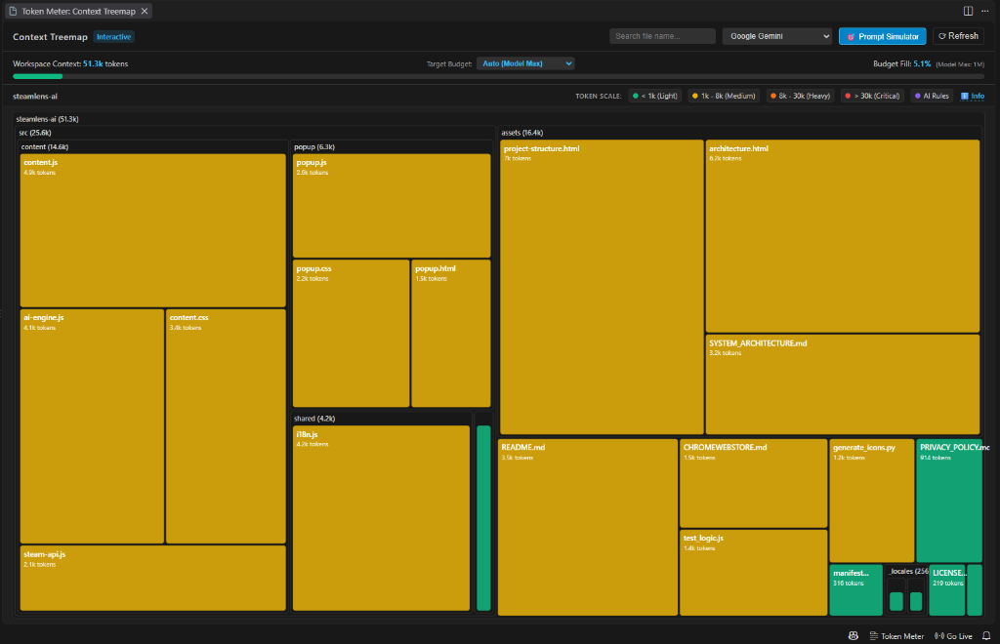
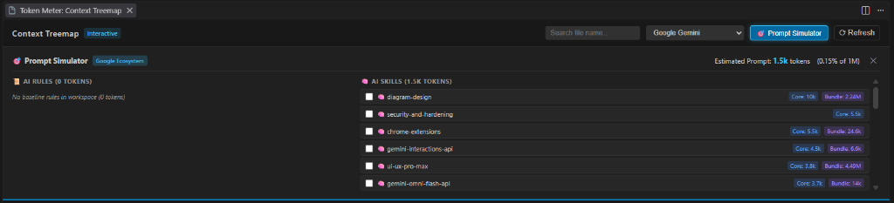
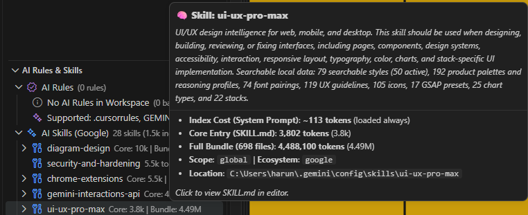
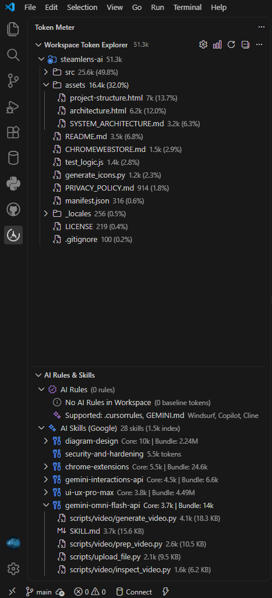

# ⚡ Token Meter - AI Context & Token Budget Visualizer

[](https://marketplace.visualstudio.com)
[](https://www.typescriptlang.org/)
[](https://d3js.org/)
[](https://opensource.org/licenses/MIT)

**Token Meter**, yapay zeka destekli geliştirme ortamlarında (**Google Antigravity, Cursor, Windsurf, Claude Code, GitHub Copilot, Cline / Roo Code**) prompt bağlam (context) maliyetlerini, AI kurallarının sabit yükünü, ekosistem becerilerini (AI Skills) ve projedeki tüm dosyaları gerçek zamanlı analiz eden profesyonel bir VS Code eklentisidir.

---

## 🌟 Neden Token Meter?

Yapay zeka modelleriyle kod yazarken context boyutu büyüdükçe:
1. **Dikkat Kaybı (*Lost in the Middle*)**: Model uzun bağlamların ortasındaki önemli kodları ve talimatları unutmaya başlar.
2. **Kümülatif Maliyet & Gecikme**: Her mesajda tüm dosya bağlamı baştan gönderildiği için token tüketimi katlanarak artar.
3. **Gizli Taban Maliyetler**: Farkında olmadan yüklenen devasa AI kuralları ve becerileri (skills) her prompt'ta yüz binlerce gereksiz token tüketebilir.

**Token Meter**, projenizin token anatomisini röntgen gibi çıkarır; neyin ne kadar bağlam tükettiğini görselleştirir ve bütçenizi kontrol altında tutmanızı sağlar.

---

## 🚀 Öne Çıkan Özellikler

### 1. 🗺️ İnteraktif Context Isı Haritası (D3.js Squarified Treemap)



* **Görsel Token Dağılımı**: Hangi dosyaların ve klasörlerin en çok bağlam tükettiğini alan büyüklüğüne göre orantılı gösterir.
* **Renk Yoğunluk Skalası (Token Density Heatmap)**:
  * 🟢 **Yeşil (< 1k)**: Hafif / Güvenli
  * 🟡 **Sarı (1k - 8k)**: Orta Düzey
  * 🟠 **Turuncu (8k - 30k)**: Ağır Dosya
  * 🔴 **Kırmızı (> 30k)**: Kritik / Dikkat Dağıtıcı (*Lost in the Middle* riski!)
  * 🟣 **Mor**: AI Kural Dosyaları (`.cursorrules`, `GEMINI.md` vb.)
* **Derinlemesine Gezinti (Zoom & Breadcrumbs)**: Klasörlere tıklayarak alt dizinleri büyütebilir, ekmek kırıntısı yoluyla geri dönebilirsiniz.
* **Anında Arama & Editör Entegrasyonu**: Dosya adı arayarak ilgili kutuyu anında bulabilir, tıkladığınızda dosyayı doğrudan VS Code editöründe açabilirsiniz.

---

### 2. 🎯 İnteraktif Prompt Bütçe Simülatörü (Prompt Simulator)



AI'a bir soru sormadan veya büyük bir görev vermeden önce **"Bu görev bana kaç token'a mal olacak?"** senaryosunu test edin:
* **Canlı Kontrol Listesi (Checklist)**:
  * 📜 **AI Rules**: Projedeki zorunlu kural dosyaları.
  * 🧠 **AI Skills**: Modele özgü kurulu beceriler.
* **Canlı Bütçe Hesabı**:
  $$\text{Tahmini Prompt} = \text{AI Kuralları} + \text{Seçilen Beceriler (Core)} + \text{Sistem İndeksi}$$
* İstediğiniz kuralları ve becerileri işaretleyip kaldırarak toplam prompt boyutunu ve bütçe doluluk oranını (% fill) anlık simüle edin.

---

### 3. 🧠 Ekosisteme Duyarlı Beceri Dedektörü (AI Skills Inspector)



Modelinize ve geliştirme ortamınıza kurulu tüm becerileri (skills) otomatik keşfeder ve **3 kademeli token analizi** sunar:
* **Ekosistem İzolasyonu**:
  * 🔵 **Google Gemini**: `~/.gemini/antigravity/builtin/skills`, `~/.gemini/config/skills`, `.gemini/skills/`
  * 🟠 **Anthropic Claude**: `~/.claude/skills/`, `.claude/skills/`
  * 🌐 **Ortak**: Proje kökündeki `.skills/`
* **3 Kademeli Token Ayrımı**:
  1. **İndeks (Catalog) Maliyeti**: Sistem promptundaki `name + description` menü yükü (~25-35 token).
  2. **Ana Giriş (Core Entry)**: `SKILL.md` gövdesinin ilk çağrılma token maliyeti.
  3. **Tüm Paket (Full Bundle)**: `ui-ux-pro-max`, `diagram-design` gibi yüzlerce alt dosya içeren dev becerilerin toplam token boyutu.
* Sol panelden alt dosyaları tek tek inceleyebilir ve tıklayıp VS Code'da açabilirsiniz.

---

### 4. 🎛️ İnteraktif Hedef Bütçe & Akıllı Sayı Formatlayıcı (Target Budget)
Projenizin veya görevinizin kapsamına göre hedef bütçenizi arayüzden tek tıkla belirleyin:
* **Hazır Şablonlar**: `16k (Free Tier)`, `32k (Light)`, `64k (Standard)`, `128k (Full Module)`, `200k (Claude Default)`, `500k`, `1M (Gemini Flash)`, `2M (Gemini Pro)`.
* **Özel Bütçe Girişi (Custom Limit)**:
  * Yazarken **canlı binlik ayracı** desteği (`2.000.000` veya `50.000`).
  * Kısa yazım desteği (`2M`, `50k`, `1.5M`).
  * Bütçe aşıldığında ilerleme çubuğu **kırmızıya döner** ve uyarı verir.
  * **`[ ✏️ ]`** düzenleme butonuyla tek tıkla bütçenizi güncelleyin.

---

### 5. 📊 Çoklu Model Tokenizer Matrisi (Future-Proof Model Matrix)
Farklı AI ailelerinin resmi sözlük (vocabulary) ve BPE algoritmalarıyla kalibre edilmiş kesin token hesaplaması:
* 🔵 **Google Gemini** (SentencePiece 256k Vocab - Çok dilli ve Türkçe metinlerde yüksek sıkıştırma)
* 🟠 **Anthropic Claude** (Anthropic BPE ~65k-100k Vocab)
* 🟢 **OpenAI (GPT & o-Series)** (OpenAI `o200k_base` Tokenizer)
* 🟣 **DeepSeek / Llama** (128k BPE Tokenizer)

---

### 6. 🌲 Workspace Token Ağacı (Token Explorer)



* **Kök Klasör & Başlık Sayacı**: Sol panel başlığında canlı toplam sayaç (**`WORKSPACE TOKEN EXPLORER 56.5k`**) ve ağaçta kök klasör (**`🗂️ proje-adi 56.5k`**) hiyerarşisi.
* **Sıralama**: Dosyaları ve klasörleri en çok token tüketenden en aza doğru listeler.
* **Filtreler**:
  * 🌐 **Tüm Proje (All Files)**
  * 🤖 **Yalnızca AI Kuralları (Rules Only)**
  * 📑 **Yalnızca Açık Sekmeler (Open Tabs Only)**

---

### 7. ⚡ Canlı Durum Çubuğu (Status Bar)
* **Aktif Dosya**: Editörde açık olan dosyanın token sayısını anlık gösterir.
* **Seçili Kod Parçası**: Kod seçildiğinde hem seçimin hem dosyanın oranını dinamik hesaplar (`$(symbol-keyword) 140 / 2.4k tokens`).
* **Hızlı Menü**: Durum çubuğuna tıklayarak modeli değiştirebilir veya Treemap'i açabilirsiniz.

---

### 8. 🚀 Yüksek Performanslı RAM Önbelleği (In-Memory Caching)
* **0 Milisaniye Model Değişimi**: Modeller arasında geçiş yaparken disk I/O yapmaz, bellekteki veriyi anında getirir.
* **Akıllı `mtime` Doğrulaması**: Dosyalar değişmediği sürece diski yormaz.
* **%0 CPU Boşta Çalışma**: Arka planda pil veya işlemci tüketmez, sıfır bellek sızıntısı (memory leak).

---

## ⚙️ Yapılandırma Ayarları (Settings)

`settings.json` dosyanızda özelleştirebileceğiniz ayarlar:

```json
{
  "tokenMeter.defaultModel": "gemini-2-flash",
  "tokenMeter.contextBudget": 200000,
  "tokenMeter.statusBarEnabled": true,
  "tokenMeter.debounceDelay": 250,
  "tokenMeter.excludePatterns": [
    "**/node_modules/**",
    "**/.git/**",
    "**/dist/**",
    "**/build/**",
    "**/out/**",
    "**/.next/**",
    "**/.nuxt/**",
    "**/coverage/**",
    "**/*.min.js",
    "**/*.min.css",
    "**/*.map",
    "**/*.lock",
    "**/package-lock.json",
    "**/yarn.lock",
    "**/pnpm-lock.yaml"
  ]
}
```

---

## 🛠️ Geliştirme ve Derleme (Development)

Projeyi yerel ortamınızda çalıştırmak veya katkıda bulunmak için:

```bash
# 1. Bağımlılıkları yükleyin
npm install

# 2. Birim testlerini çalıştırın (12 Test Suite)
npm test

# 3. Geliştirme modu (Watch Mode)
npm run watch

# 4. Üretim paketi derleme (Production Build)
npm run build:prod

# 5. VSIX Eklenti Paketi Oluşturma
npx vsce package --no-dependencies
```

---

## 📄 Lisans

Bu proje [MIT Lisansı](LICENSE) altında lisanslanmıştır.
